# Seedling

**Coding interviews for people who build with AI agents.**

Seedling gives each candidate a real sandbox with Claude Code, an editor, a terminal and a browser, and gives the interviewers a live view of everything they do with it. The AI key never leaves your server, every request is metered against a per-candidate budget, and access shuts off by itself when the time is up.

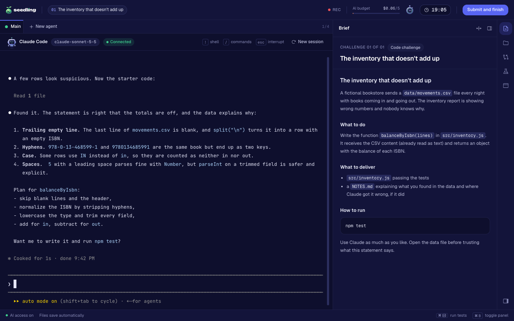

Seedling is built and used by [Árvore](https://github.com/arvoreeducacao) to hire engineers. It is licensed under Apache 2.0.

## Why

Most engineering work now goes through an agent. The skills that matter changed with it: framing a problem, giving the agent the right context, splitting work across several agents, noticing when it is wrong, and checking the result before trusting it. A whiteboard or a timed puzzle with AI turned off measures none of that.

Seedling interviews the way people actually work:

- **The agent is in the room.** Claude Code runs in the candidate's sandbox from the first second, through Seedling's gateway. Candidates can open more agents in parallel, each in its own git worktree.
- **The process is the signal.** Interviewers see every prompt, every tool call, the terminal and the open file as they happen, and the report shows minute by minute how the candidate used the AI.
- **Challenges have traps.** Each challenge ships with hidden tests and a rubric of traps (bad data, misleading statements) that a candidate who blindly trusts the agent will miss.
- **It is safe to hand out.** The candidate gets a short-lived pass with a spending cap, not your API key. Hidden tests, the reference solution and the rubric never reach the sandbox.

## Tour

### Run the hiring loop from one place

The overview shows who is live right now, who is waiting on a review, and how much the AI has cost this month.

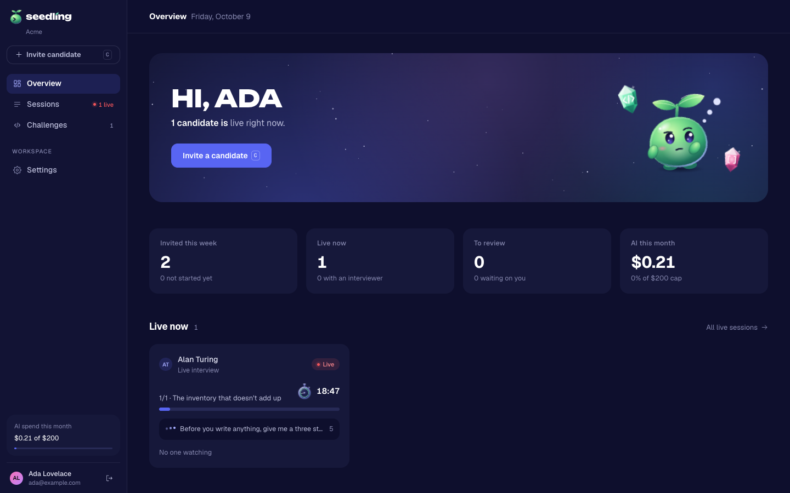

### Upload a challenge, get it checked

A challenge is a folder zipped up. Seedling splits what the candidate sees from what only the team sees, then runs pre-publish checks in a container with no network: the reference solution passes the hidden tests, the starter code does not, there are no secrets in the files, and the brief does not leak a hidden file. Traps listed in the rubric become markers for the debrief.

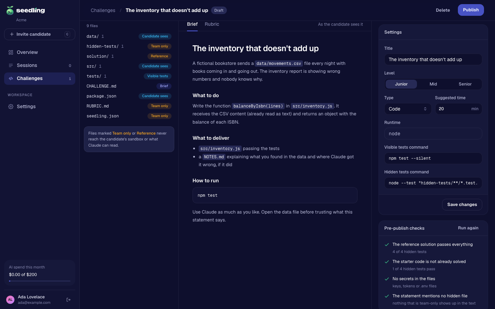

### Invite one candidate or twenty

Pick the challenges, the format (live or take-home), the interview date, the time limit, the model and the AI budget per person. Seedling emails the links, or shows them to copy when SMTP is not set.

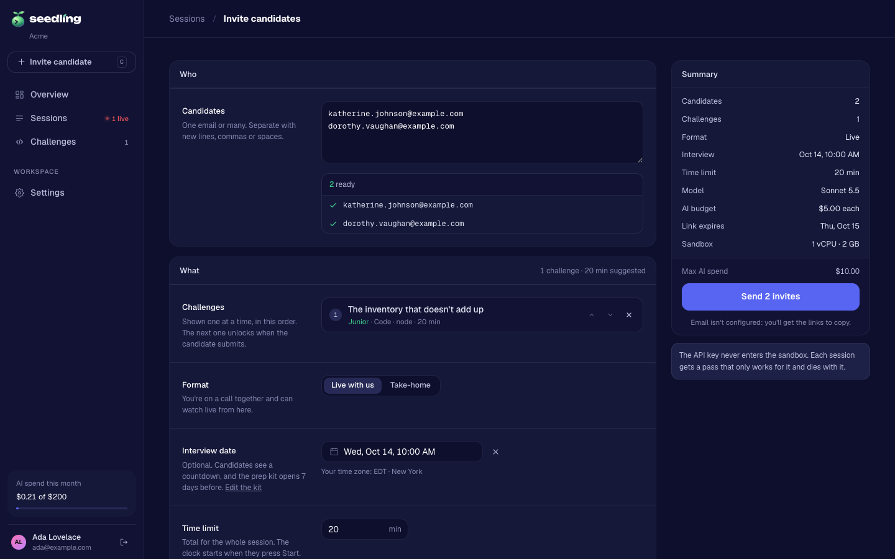

### Give candidates a place to prepare

The invite link opens a step-by-step prep space before the interview: how your team works, a few reads, an optional practice sandbox to try Claude Code, and the setup candidates may bring (skills, a `CLAUDE.md`, remote MCP servers), installed only in their own sandbox. A countdown shows when the interview starts, and the team sees how far each candidate got.

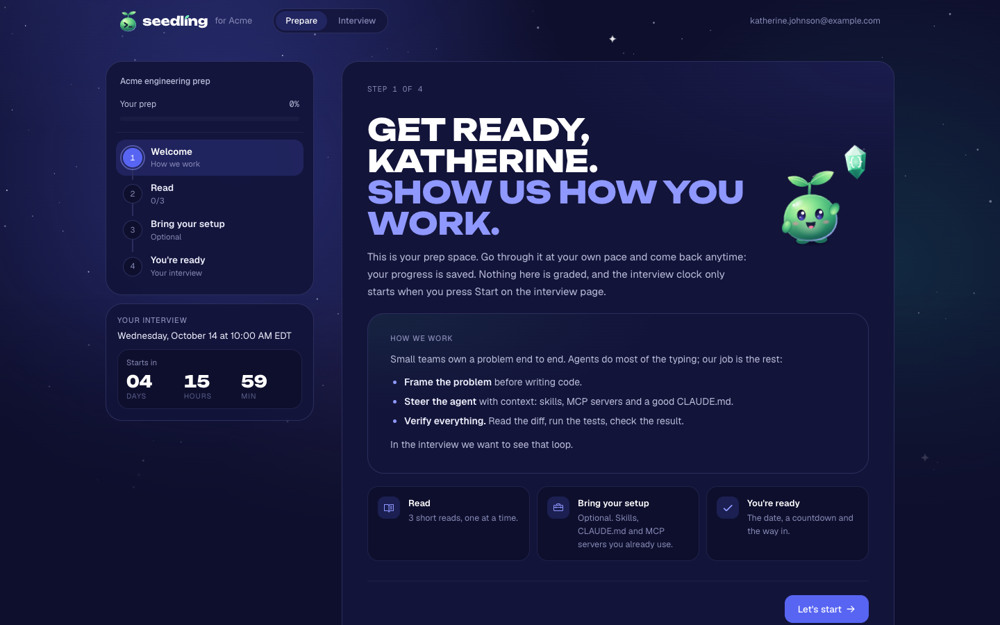

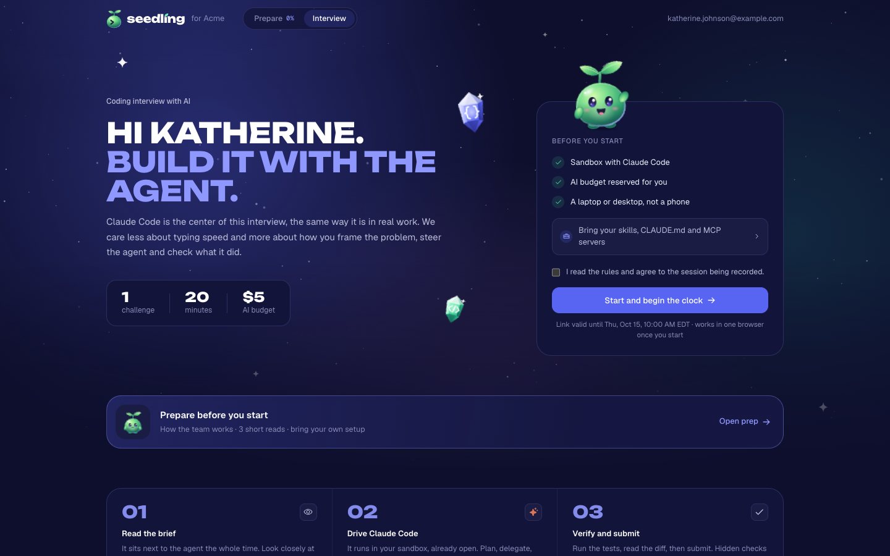

### Code with Claude Code

The workspace is a terminal running Claude Code, with the brief, a file tree, a diff of changes per agent, the visible tests and a browser for whatever the candidate is building. Candidates can open up to four agents side by side and merge their work back with one click.

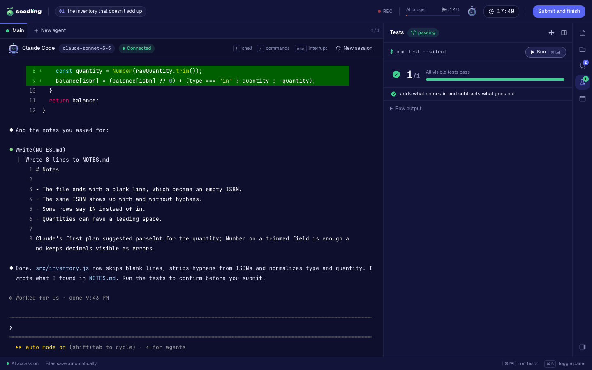

### Watch it live

Interviewers see the candidate's terminal mirrored read-only, every prompt with its tool calls and cost, the open file, the diff and the browser. They can leave private notes pinned to the minute, add time, message the candidate or cut AI access.

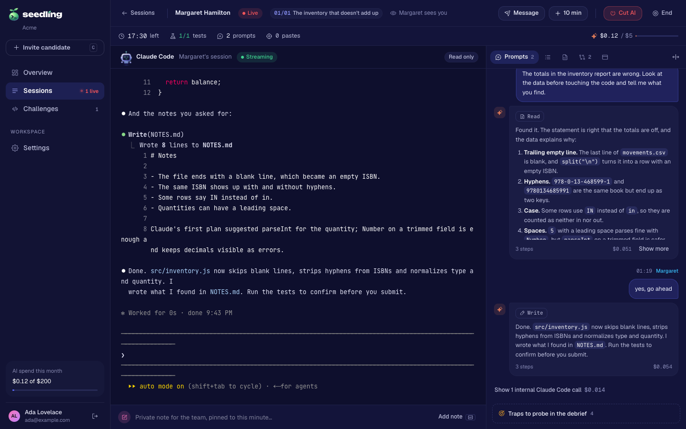

### Decide with evidence

On submission, or when time runs out, AI access is revoked and the hidden tests run in a fresh container. The report brings together the score, the traps the candidate found, how they used Claude minute by minute, what they prepared, every request they sent, each interviewer's review and the decision. Seedling can also draft follow-up questions from the session log.

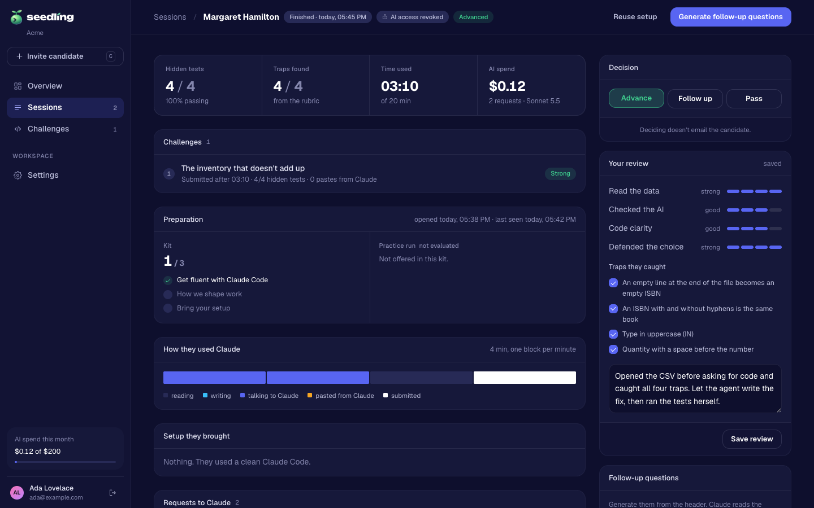

### Know what is configured

Settings shows what the server read from its environment: the prep kit, how the AI key is protected, sandbox limits, sign-in methods, admins, and an append-only audit log.

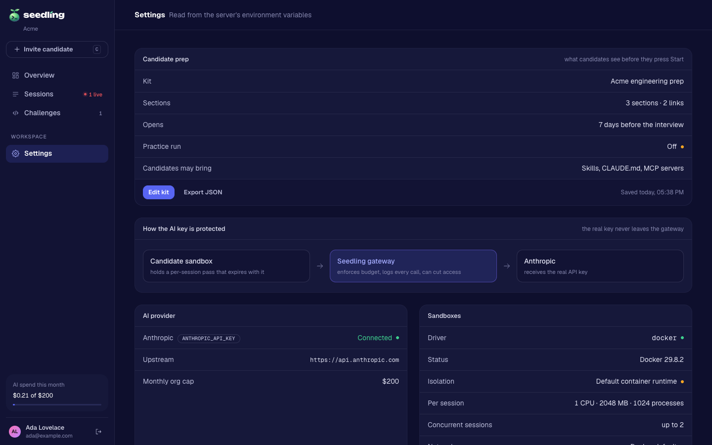

## Quick start

You need Docker and an [Anthropic API key](https://console.anthropic.com/). Seedling starts containers through the host's Docker socket, so run it on a machine dedicated to it.

```sh
git clone https://github.com/arvoreeducacao/seedling.git
cd seedling
docker build -t seedling-sandbox:latest sandbox
cp .env.example .env
```

Edit `.env`:

- `BETTER_AUTH_SECRET`: a long random string, for example `openssl rand -base64 32`.
- `ANTHROPIC_API_KEY`: your key. It stays on the server.
- `SEEDLING_ADMIN_EMAILS`: your email, so you can create the first account.

Then start it:

```sh
mkdir -p "$HOME/seedling-data"
SEEDLING_HOST_DATA_DIR="$HOME/seedling-data" docker compose up -d --build
```

Open http://localhost:3100, create your account with the email you listed, and upload `examples/book-inventory` as a `.zip` under **Challenges**. If you leave `SEEDLING_ADMIN_EMAILS` empty, the server log prints a one-time setup link instead (`docker compose logs seedling`).

`docker-compose.yml` puts sandboxes on an internal Docker network that can only reach the Seedling server, so candidates reach Claude through the gateway and nothing else. `SEEDLING_HOST_DATA_DIR` must be a path on the host, because Docker mounts session folders from it into each sandbox.

Prebuilt images are published for every commit on `main`:

- `ghcr.io/arvoreeducacao/seedling-web`
- `ghcr.io/arvoreeducacao/seedling-sandbox`

## Run it for development

Requirements: Node 22+, pnpm 10 (`corepack enable`) and Docker.

```sh
pnpm install
docker build -t seedling-sandbox:latest sandbox
cp .env.example .env.local
pnpm dev
```

Open http://localhost:3100. `pnpm test` runs the test suite and `pnpm build` builds the app. See [CONTRIBUTING.md](CONTRIBUTING.md).

## Configuration

Seedling reads everything from environment variables. Only `BETTER_AUTH_SECRET` and `ANTHROPIC_API_KEY` are required.

### Server

| Variable | Default | What it does |
|---|---|---|
| `SEEDLING_URL` | `http://localhost:3100` | Public URL of the app. Links in emails and invites use it, and `https://` turns on secure cookies. |
| `PORT` | `3100` | Port the server listens on. |
| `SEEDLING_ORG_NAME` | `Seedling` | Your company name, shown to candidates. |
| `SEEDLING_DATA_DIR` | `./data` | Where the database, challenges and session workspaces live. |
| `DATABASE_URL` | `file:<data dir>/seedling.db` | libSQL URL. A local SQLite file by default; a remote libSQL server also works. |
| `DATABASE_AUTH_TOKEN` | | Token for a remote libSQL database. |
| `NEXT_PUBLIC_SEEDLING_TIMEZONE` | runtime default | IANA time zone for dates, for example `America/New_York`. Read at build time. |
| `SEEDLING_MONTHLY_BUDGET_USD` | `200` | Monthly AI spend the panel tracks your total against. |

### Accounts and sign-in

| Variable | Default | What it does |
|---|---|---|
| `BETTER_AUTH_SECRET` | | Required. Signs sessions, invite cookies and preview tickets. |
| `SEEDLING_ADMIN_EMAILS` | | Comma-separated emails that can create an admin account. Empty means the first account comes from the one-time setup link printed on start. |
| `SEEDLING_ALLOWED_EMAIL_DOMAINS` | | Restricts admin sign-up to these domains. |
| `GOOGLE_CLIENT_ID`, `GOOGLE_CLIENT_SECRET` | | Turns on Google sign-in. |
| `GITHUB_CLIENT_ID`, `GITHUB_CLIENT_SECRET` | | Turns on GitHub sign-in. |
| `SMTP_URL` | | SMTP connection URL for invite and confirmation emails. Without it, links are shown to copy. |
| `SEEDLING_MAIL_FROM` | `Seedling <no-reply@localhost>` | Sender of those emails. |

### AI gateway

| Variable | Default | What it does |
|---|---|---|
| `ANTHROPIC_API_KEY` | | Required. The real key. Only the server uses it. |
| `ANTHROPIC_UPSTREAM_URL` | `https://api.anthropic.com` | Where the gateway forwards requests. Any Anthropic-compatible endpoint works. |
| `ANTHROPIC_MODEL_PREFIX` | | Prefix added to model ids upstream, for gateways that namespace models (for example `anthropic/`). |
| `SEEDLING_AI_MAX_OUTPUT_TOKENS` | `32000` | Cap on `max_tokens` per request. |
| `SEEDLING_AI_MAX_THINKING_TOKENS` | `16000` | Cap on extended thinking per request. |
| `SEEDLING_AI_MAX_EFFORT` | `high` | Highest effort level a request may ask for. |
| `SEEDLING_AI_MAX_INFLIGHT` | twice the agent limit, at least 4 | Parallel requests allowed per session. |

### Sandboxes

| Variable | Default | What it does |
|---|---|---|
| `SEEDLING_SANDBOX_DRIVER` | `docker` | Sandbox driver. Docker is the only one today. |
| `SEEDLING_SANDBOX_IMAGE` | `seedling-sandbox:latest` | Image for candidate sandboxes. |
| `SEEDLING_SANDBOX_GATEWAY_URL` | `http://host.docker.internal:3100` | How a sandbox reaches the Seedling server. |
| `SEEDLING_SANDBOX_HOST_DATA_DIR` | the data dir | The data dir as the Docker daemon sees it, when Seedling itself runs in a container. |
| `SEEDLING_SANDBOX_NETWORK` | | Docker network for sandboxes. Set it to an internal network to cut sandboxes off from the internet. |
| `SEEDLING_SANDBOX_RUNTIME` | | Container runtime, for example `runsc` for gVisor. |
| `SEEDLING_SANDBOX_CPUS` | `1` | CPUs per sandbox. |
| `SEEDLING_SANDBOX_MEMORY_MB` | `2048` | Memory per sandbox. |
| `SEEDLING_SANDBOX_PIDS` | `1024` | Process limit per sandbox. |
| `SEEDLING_SANDBOX_WORKSPACE_MAX_MB` | `200` | Workspace size limit. |
| `SEEDLING_SANDBOX_MAX_CONCURRENT` | `2` | Sandboxes running at the same time. |
| `SEEDLING_MAX_AGENTS` | `4` | Claude Code agents per session, counting the main one. |
| `SEEDLING_SETUP_DISABLE` | | Comma-separated setup the candidate may not bring, overriding the prep kit: `skills`, `claude-md`, `mcp` or `all`. |
| `DOCKER_HOST` | local socket | Docker daemon to use, for example `tcp://127.0.0.1:2375` next to a Docker-in-Docker sidecar. |

### Candidate previews

| Variable | Default | What it does |
|---|---|---|
| `SEEDLING_PREVIEW_ORIGIN` | app port + 1 on localhost | Separate origin that serves the pages candidates build. In production use a host on a domain of its own. Unset outside localhost turns the browser panel off. |
| `SEEDLING_PREVIEW_PORT` | | Port for the preview listener when it differs from the origin's port. |

## Architecture

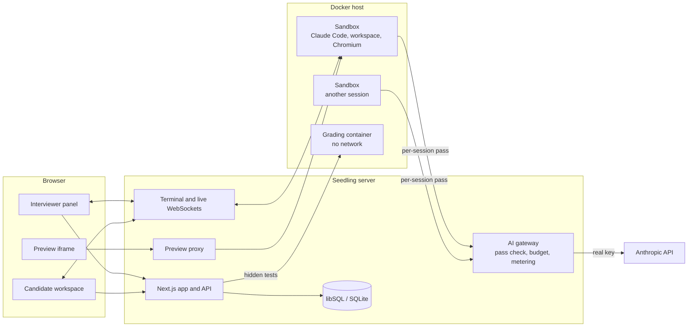

- **One process.** `server.ts` runs Next.js, the terminal and live-view WebSockets, the preview proxy and a sweeper that ends expired sessions. Seedling runs as a single replica.
- **Sandboxes.** Each session gets a container from `sandbox/Dockerfile`: Node 22, Python 3, git, ripgrep, Claude Code, headless Chromium and the Playwright MCP server. The candidate runs as uid 1000 with no capabilities, a read-only root filesystem and CPU, memory and process limits.
- **The gateway.** Claude Code in the sandbox talks to `/api/gateway/anthropic` with a pass that only works for that session. The gateway checks the pass, reserves the worst-case cost of the request against the budget, clamps tokens and effort, forwards it with the real key and records the request for the live view and the report.
- **Grading.** On submission the hidden tests run in a fresh container with no network, against a copy of the workspace.
- **Storage.** Accounts, challenges, sessions and every AI request live in SQLite through Drizzle. Challenge files and workspaces live under `SEEDLING_DATA_DIR`.

## Security model

The short version:

- The real API key never enters a sandbox. Passes expire with the session, carry a spending cap, and are revoked on submission.
- Hidden tests, the reference solution and the rubric are never copied into the sandbox or shown to Claude.
- Candidate pages are served from a separate origin inside a sandboxed iframe, behind a short-lived signed ticket.
- The agent's browser can reach localhost and the public internet only; private, link-local and metadata addresses are refused after DNS resolution.
- Every read and write of candidate files resolves the real path and stays inside that session's workspace.

Read [SECURITY.md](SECURITY.md) for the full list, the known limits, and how to report a vulnerability.

## Writing a challenge

A challenge is a folder. Zip it and upload it under **Challenges**.

```
CHALLENGE.md          what the candidate reads (README.md also works)
src/, data/, ...      starter code and data, visible to the candidate
tests/                visible tests
hidden-tests/         team only, run on submission
solution/             reference solution, same paths as the starter code
RUBRIC.md             team only; the "## Traps" section becomes markers in the report
seedling.json         optional settings
```

`seedling.json`:

```json
{
  "title": "The inventory that doesn't add up",
  "level": "junior",
  "kind": "code",
  "minutes": 20,
  "runtime": "node",
  "test": { "visible": "npm test --silent", "hidden": "node --test \"hidden-tests/**/*.test.js\"" },
  "preview": { "command": "npm run dev", "port": 5173 }
}
```

Every field is optional. `level` is `junior`, `mid` or `senior`. `kind` is `code`, or `screen` for challenges where the candidate builds a UI (a `preview` implies it). `runtime` is inferred: `node` when there is a `package.json`, `python` when there are `.py` files or a `requirements.txt`. Test commands are inferred from the runtime and the folders.

What makes a good challenge:

- **Something the agent will get wrong if nobody looks.** Messy data, a brief that contradicts the data, an edge case the tests do not show. List them under `## Traps` in `RUBRIC.md` so interviewers can check them off.
- **Small enough to finish.** Twenty to sixty minutes of real work with an agent, not a project.
- **Hidden tests that check behavior.** The pre-publish checks make sure the reference solution passes them and the starter code does not.

`examples/book-inventory` is a complete example. Folder names in Portuguese (`ENUNCIADO.md`, `testes/`, `testes-ocultos/`, `solucao/`, `RUBRICA.md`, `## Armadilhas`) are also recognized.

## Prep kits

The prep kit is what candidates see before they press Start. Configure it in **Settings → Candidate prep**: how your team works, ordered sections with markdown and links, a practice run (a playground sandbox with a small sample project, one of your published challenges, or none; it has its own time and budget and is never evaluated), what candidates may bring, and how many days before the interview it opens.

Kits are plain JSON, so teams can share them. `examples/prep` has the format and the kit Árvore uses for its engineering interviews, as an example to adapt.

## More

- **Several agents at once.** New agent opens another Claude Code in its own git worktree, mounted at `/agents/<name>`. The Changes panel shows each agent's diff and merges it into the workspace. The report adds a timeline of agents working in parallel.
- **The workspace browser.** The side panel opens any port listening in the sandbox, or an `.html` file, from the preview origin. Claude Code has a headless browser of its own through the Playwright MCP server, and the panel mirrors what it sees.
- **Bring your setup.** Skills, a `CLAUDE.md` and remote MCP servers the candidate uploads in the prep space are installed in their sandbox when the interview starts. Secrets in MCP headers are masked for the team.
- **Kubernetes.** [`deploy/kubernetes`](deploy/kubernetes) has an example with a Docker-in-Docker sidecar and egress rules for the sandboxes.

## Contributing

Issues and pull requests are welcome. Read [CONTRIBUTING.md](CONTRIBUTING.md) first, and report security problems privately as described in [SECURITY.md](SECURITY.md). This project follows the [Contributor Covenant](CODE_OF_CONDUCT.md).

## License

[Apache License 2.0](LICENSE). Copyright 2026 Árvore Educação.
